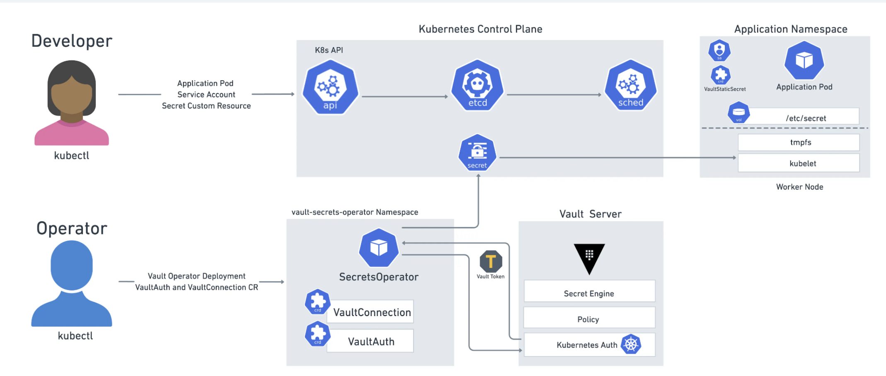

#### Creating and Consuming Secrets

- Create the Secret: Execute the following command to create the secret:

```bash
kubectl create ns development && kubectl apply -f 01-secret.yaml
```{{exec}}
    
- Create the Pod: Deploy the pod that consumes this secret with:
    
```bash
kubectl apply -f 02-pod-secret.yaml
```{{exec}}

#### Enhanced Secret Management with HashiCorp Vault




Setup and Usage

- Add HashiCorp Repo and Install Vault Chart:

```
helm repo add hashicorp https://helm.releases.hashicorp.com
helm repo update
helm upgrade --install vault hashicorp/vault -n vault --create-namespace --values vault/vault-values.yaml
```{{exec}}
    
- Access Vault CLI:

```bash
kubectl exec --stdin=true --tty=true vault-0 -n vault -- /bin/sh
```{{exec}}

- Enable Kubernetes Auth Method:

```bash
vault auth enable -path securing-k8s kubernetes
```{{exec}}
    
- Configure Kubernetes Auth Method:

```
vault write auth/securing-k8s/config \
    kubernetes_host="https://$KUBERNETES_PORT_443_TCP_ADDR:443"
```{{exec}}
    
- Enable KV v2 Secrets Engine:

```
vault secrets enable -path=k8s-dev kv-v2
```{{exec}}
    
- Create Read-only Policy:

```
vault policy write dev - <<EOF
path "k8s-dev/*" {
capabilities = ["read"]
}
EOF
```{{exec}}
    
- Create Role:

```
vault write auth/securing-k8s/role/dev-role \
    bound_service_account_names=default \
    bound_service_account_namespaces=development \
    policies=dev \
    ttl=24h
```{{exec}}
    
- Create Secret in Vault:

```bash
vault kv put k8s-dev/dev-app/config username="dev" password="dev-password"
```{{exec}}


#### To Access Vault UI

- Generate the token

```bash
vault token create
```{{exec}}

- Port forward

```bash
kubectl port-forward vault-0 8200:8200 -n vault --address 0.0.0.0
```{{exec}}

#### Using Vault Secrets Operator

- Install Vault Secrets Operator:

```bash
helm upgrade --install vault-secrets-operator hashicorp/vault-secrets-operator -n vault --values vault/vault-operator-values.yaml
```{{exec}}
    
- Set up Kubernetes Authentication for Secret:

```bash
kubectl apply -f vault/dev-auth.yaml
```{{exec}}

- Create Secret:
    
```bash
kubectl apply -f vault/demo-secret.yaml
```{{exec}}

```bash
kubectl apply -f 03-pod-vault-secret.yaml 
```{{exec}}

- Update Secret in Vault:

```bash
vault kv put k8s-dev/dev-app/config username="dev" password="new-super-password" token="I am a token"
```{{exec}}

- Check the Updated Secret in the Pod: After updating the secret in Vault, verify its propagation by checking the pod consuming the secret.

```bash
kubectl logs deployments/deployment-with-vault-secret  -n development 
```{{exec}}