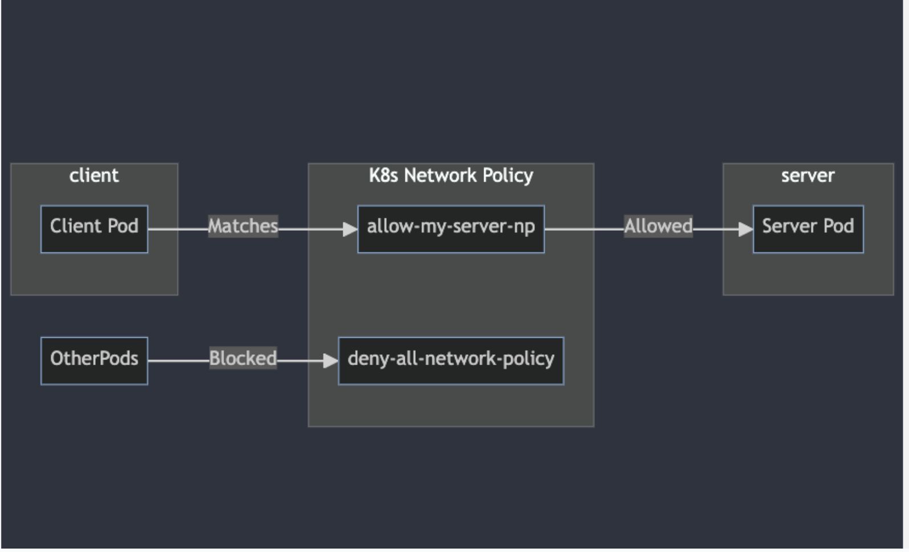

Segmentation is your key tool to enforce a zero-trust approach within your cluster. It limits the blast radius should a pod get compromised by preventing attackers from easily moving throughout your network.

- Enhanced Security
- Isolation
- Compliance
- Performance and Traffic Management

### Network Policy
The native Kubernetes way. Network policies let you define fine-grained rules to limit access among workloads

### Container Network Interface (CNI)
Many third-party networking solutions offer advanced features:
- Calico: Popular for its rich network policy capabilities, fine-grained controls, and visualization options.
- Cilium: Emphasizes eBPF for high-performance networking and policy enforcement. Often used in large-scale clusters.
- Flannel: A simpler CNI option for basic overlay networking. Provides less granular segmentation than some others.
