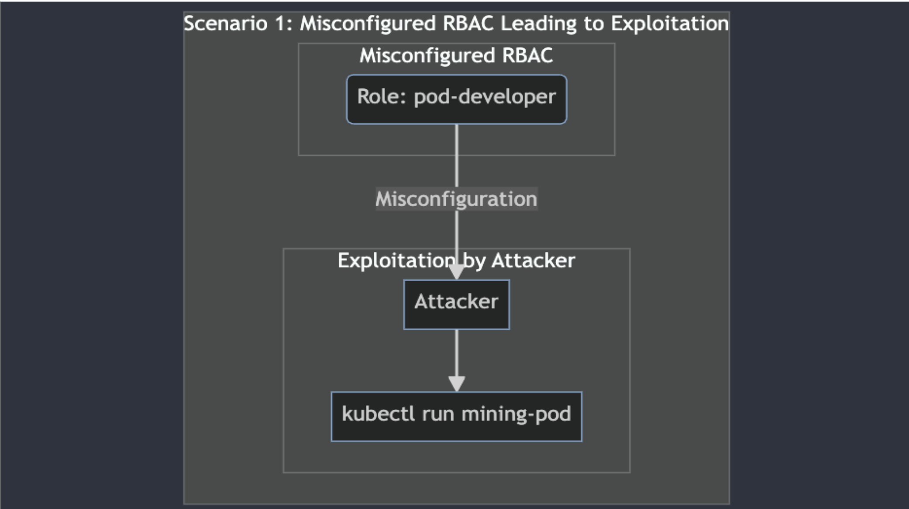
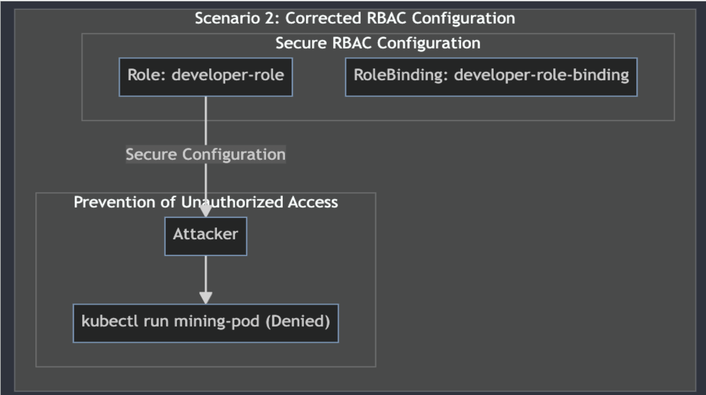

#### Overly Permissive Roles



1. **Creating Required Resources for RBAC :**
   To set up the necessary resources for the demo, execute the following command. It will create a Service Account and bind it to a broad role.
    ```
    kubectl apply -f 06-rbac-exploit-access.yaml
    ```{{exec}}

2. **Generating Token and CA Certificate:**
   To generate the token and CA certificate required for testing commands, use the following commands:
    ```
    TOKEN=$(kubectl -n development get secret pod-developer-token -o jsonpath='{.data.token}' | base64 --decode)
    kubectl get secret pod-developer-token -n development -o jsonpath="{.data['ca\.crt']}" | base64 -d > ca.crt
    ```{{exec}}

3. **Getting API Server Address:**
   Retrieve the API server address by executing the command below. The output will provide the necessary server address.
    ```
    kubectl cluster-info
    ```{{exec}}

   Output Example:
    ```
    Kubernetes control plane is running at https://127.0.0.1:54237
    CoreDNS is running at https://127.0.0.1:54237/api/v1/namespaces/kube-system/services/kube-dns:dns/proxy
    To further debug and diagnose cluster problems, use 'kubectl cluster-info dump'.
    ```{{exec}}

   Trim the address using the command:
    ```
    export APISERVER=$(kubectl cluster-info | grep -o 'https://[0-9\.]*:[0-9]*' | awk 'NR==1{print}')
    ```{{exec}}

4. **Testing Attacker's Privilege:**
   To check if the attacker has full privileges, execute the following cURL command:
    ```
    curl -X POST -H "Authorization: Bearer $TOKEN" -H "Content-Type: application/json" \
    -d '{"apiVersion":"v1","kind":"Pod","metadata":{"name":"nginx-pod"},"spec":{"containers":[{"name":"nginx","image":"nginx"}]}}' \
    ${APISERVER}/api/v1/namespaces/default/pods --cacert ca.crt
    ```{{exec}}

   Upon successful execution, you will receive the JSON response indicating the creation of the pod.

### Least Privilege RBAC



1. **Creating Required Resources for RBAC :**
   To set up the necessary resources for the demo, execute the following command. It will create a Service Account and bind it to a broad role.
    ```
    kubectl apply -f 07-rbac-limited-access.yaml
    ```{{exec}}

2. **Generating Token and CA Certificate:**
   To generate the token and CA certificate required for testing commands, use the following commands:
    ```
    READER_TOKEN=$(kubectl -n development get secret pod-reader-token -o jsonpath='{.data.token}' | base64 --decode)
    kubectl get secret pod-reader-token -n development -o jsonpath="{.data['ca\.crt']}" | base64 -d > readerca.crt
    ```{{exec}}

3. **Testing Pod reader with high Privilege:**
   - To check if the attacker has full privileges, execute the following cURL command:
    ```
    curl -X POST -H "Authorization: Bearer $READER_TOKEN" -H "Content-Type: application/json" \
    -d '{"apiVersion":"v1","kind":"Pod","metadata":{"name":"nginx-pod"},"spec":{"containers":[{"name":"nginx","image":"nginx"}]}}' \
    ${APISERVER}/api/v1/namespaces/default/pods --cacert readerca.crt
    ```{{exec}}

   You will receive the JSON response indicating Forbidden request
   - Try listing the pods in `default` namespace:
   ```
   curl -H "Authorization: Bearer $READER_TOKEN" ${APISERVER}/api/v1/namespaces/default/pods --cacert readerca.crt
   ```{{exec}}

   It will also fail 
   - Try listing the pods in `development` namespace:
   ```
   curl -H "Authorization: Bearer $READER_TOKEN" ${APISERVER}/api/v1/namespaces/development/pods --cacert readerca.crt
   ```{{exec}}
   
   This will list all the pods in the `development` namespace successfully 
