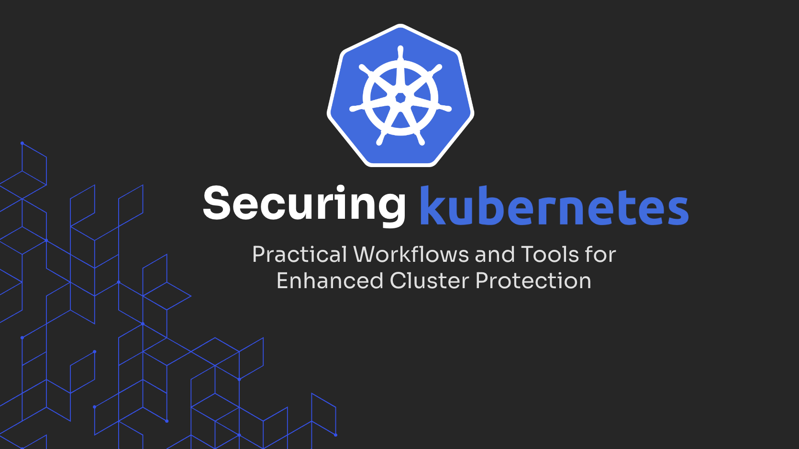

# Securing Kubernetes: Practical Workflows and Tools for Enhanced Cluster Protection

## Agenda

### 1. [Security Challenges in Kubernetes](./01_setup/README.md)
### 2. [Cluster Defense Strategies](./02_defense_strategies/README.md)
### 3. [Proactive Vulnerability Mitigation](./03_Proactive_vulnerability_mitigation/README.md)
### 4. [Resilient Supply Chain](./04_resillient_supply_chain/README.md)
### 5. [Continuous Security in Kubernetes](./05_continous_security/README.md)

## Slides
[Slides](./Securing%20K8s%20-%20Workshop.pdf)
